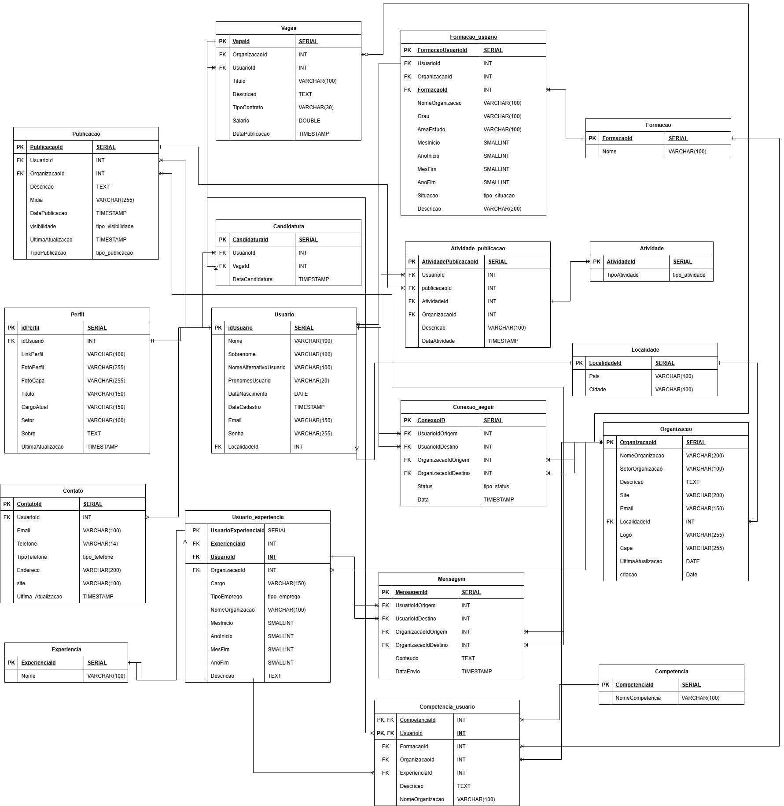

# 💼 Plataforma Profissional — Modelagem de Banco de Dados

Projeto de modelagem e implementação de um banco de dados relacional desenvolvido em **PostgreSQL**, inspirado na estrutura de uma plataforma profissional semelhante ao LinkedIn.

O objetivo do projeto foi criar uma base de dados capaz de suportar funcionalidades como criação de perfis, organizações, experiências profissionais, formações, competências, conexões, publicações, vagas, candidaturas, mensagens e interações.

---

## 📌 Sobre o projeto

A proposta consiste na modelagem de uma plataforma profissional onde usuários e organizações podem interagir, compartilhar informações e participar de uma rede profissional.

O banco de dados foi estruturado com foco em:

- organização e relacionamento dos dados;
- integridade referencial;
- normalização;
- regras de negócio;
- flexibilidade para relacionamentos complexos;
- otimização de consultas frequentes.

---

## 🗂️ Modelagem do banco de dados

O banco foi estruturado a partir de entidades que representam os principais elementos de uma plataforma profissional.

### Principais entidades

- `usuario`
- `perfil`
- `contato`
- `organizacao`
- `localidade`
- `formacao`
- `experiencia`
- `competencia`
- `vaga`
- `candidatura`
- `publicacao`
- `atividade`
- `atividade_publicacao`
- `mensagem`

Também foram utilizadas tabelas associativas para representar relacionamentos entre as entidades:

- `formacao_usuario`
- `usuario_experiencia`
- `competencia_usuario`
- `conexao_seguir`

---

## 🧩 Diagrama do banco de dados




---

# 🔗 Relacionamentos

O projeto possui diferentes tipos de relacionamentos entre as entidades.

## Usuários e experiências profissionais

O relacionamento entre usuários e suas experiências profissionais é representado por uma tabela associativa.

```text
usuario
   │
   ▼
usuario_experiencia
   │
   ▼
experiencia
````

Além da experiência, a tabela permite registrar informações como cargo, tipo de emprego, organização e período da experiência.

---

## Usuários e formações

As formações educacionais dos usuários são relacionadas por meio da tabela `formacao_usuario`.

```text
usuario
   │
   ▼
formacao_usuario
   │
   ▼
formacao
```

Essa estrutura permite armazenar informações relacionadas à trajetória educacional dos usuários.

---

## Usuários e competências

As competências podem ser associadas aos usuários e também relacionadas a diferentes contextos profissionais.

```text
usuario
   │
   ▼
competencia_usuario
   │
   ▼
competencia
```

Essa modelagem permite representar habilidades associadas a usuários, formações, experiências ou organizações.

---

## Conexões e relacionamentos

A tabela `conexao_seguir` representa os vínculos entre usuários e organizações, permitindo modelar conexões semelhantes às existentes em uma rede profissional.

```text
usuario / organização
        │
        ▼
  conexao_seguir
        │
        ▼
usuario / organização
```

---

# 🔐 Integridade dos dados

Foram utilizadas chaves primárias e estrangeiras para garantir a integridade referencial entre as tabelas.

### Chaves primárias

As entidades possuem identificadores únicos para cada registro.

```sql
PRIMARY KEY
```

### Chaves estrangeiras

As chaves estrangeiras estabelecem os relacionamentos entre as tabelas.

```sql
FOREIGN KEY
```

Também foram utilizadas chaves compostas em algumas tabelas associativas.

---

## Exclusão de registros

Foram utilizadas diferentes estratégias para lidar com a exclusão de dados.

### `ON DELETE CASCADE`

Utilizado em relações onde os registros dependentes deixam de fazer sentido sem o registro principal.

Exemplo:

```text
Usuário removido
      ↓
Perfil relacionado removido
Contato relacionado removido
Competências associadas removidas
```

### `ON DELETE SET NULL`

Utilizado em situações onde é necessário preservar informações históricas, mesmo quando o relacionamento original deixa de existir.

---

# 🛡️ Constraints e regras de negócio

Foram utilizadas diferentes constraints para garantir a consistência dos dados.

### `PRIMARY KEY`

Garante a identificação única de cada registro.

### `FOREIGN KEY`

Mantém a integridade entre entidades relacionadas.

### `UNIQUE`

Evita a duplicação de informações críticas.

Exemplo:

```text
email
```

### `CHECK`

Garante que determinadas regras de negócio sejam respeitadas.

Um exemplo é o controle de publicações realizadas por um usuário ou por uma organização.

### `DEFAULT`

Define valores automáticos para determinados campos, como datas de criação.

### `NOT NULL`

Evita o armazenamento de registros incompletos em campos obrigatórios.

---

# ⚡ Índices e otimização

Além da modelagem e implementação do banco, foram criados índices para otimizar consultas frequentes da aplicação.

Alguns exemplos incluem:

* `idx_usuario_email`
* `idx_publicacao_data`
* `idx_vaga_titulo`
* `idx_competencia_nome`

Esses índices contribuem para melhorar operações como:

* busca de usuários;
* recuperação de perfis;
* ordenação de publicações;
* pesquisa de vagas;
* busca por competências.

Também foram considerados índices em colunas utilizadas como chaves estrangeiras para melhorar o desempenho de `JOINs` em consultas mais complexas.

---

# 🛠️ Tecnologias e conceitos utilizados

* PostgreSQL
* SQL
* Modelagem de Dados
* Banco de Dados Relacional
* Normalização
* Chaves Primárias
* Chaves Estrangeiras
* Chaves Compostas
* Relacionamentos 1:N
* Relacionamentos N:N
* Tabelas Associativas
* Constraints
* `PRIMARY KEY`
* `FOREIGN KEY`
* `UNIQUE`
* `CHECK`
* `DEFAULT`
* `NOT NULL`
* `ON DELETE CASCADE`
* `ON DELETE SET NULL`
* Índices
* Otimização de Consultas

---


# 🚀 Como visualizar o projeto

### 1. Clone o repositório

```bash
git clone LINK_DO_SEU_REPOSITORIO
```

### 2. Crie um banco de dados PostgreSQL

```sql
CREATE DATABASE plataforma_profissional;
```

### 3. Execute o script SQL

Execute o arquivo responsável pela criação das tabelas, relacionamentos, constraints e índices no banco criado.

---

# 💡 Possíveis evoluções

Algumas possíveis evoluções para o projeto incluem:

* desenvolvimento de uma API para acesso aos dados;
* criação de uma interface para a plataforma;


